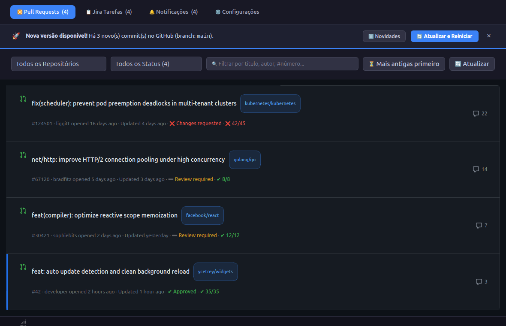
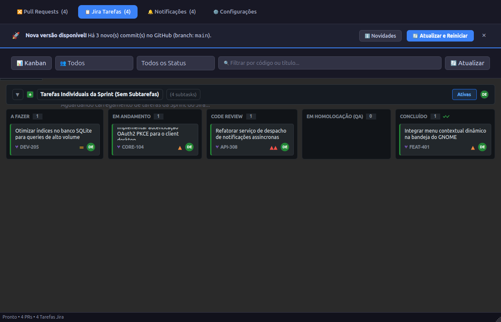
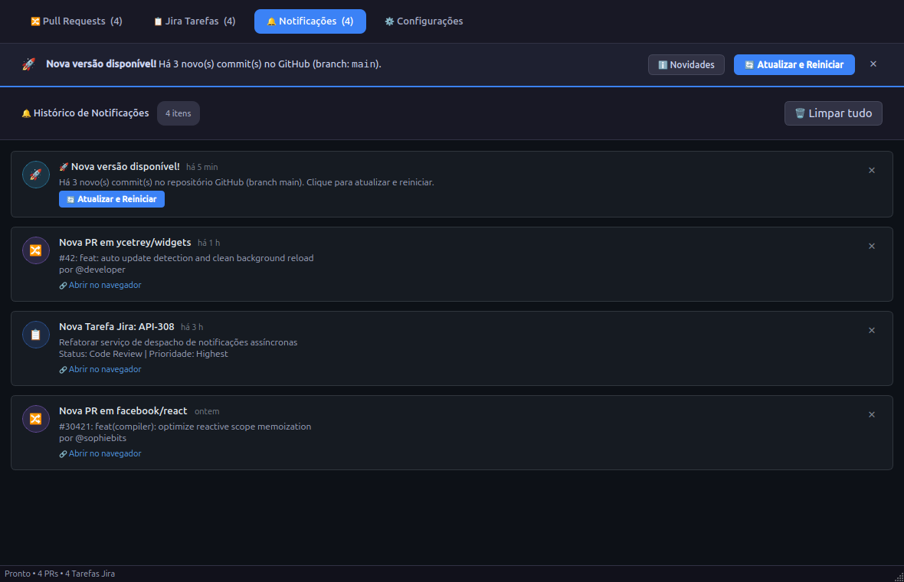
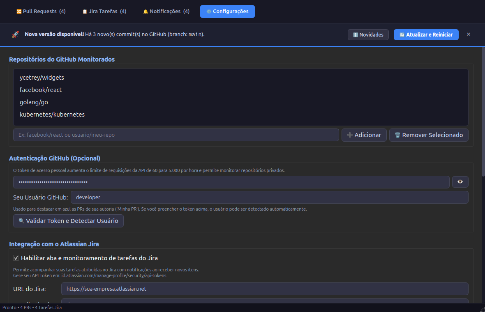
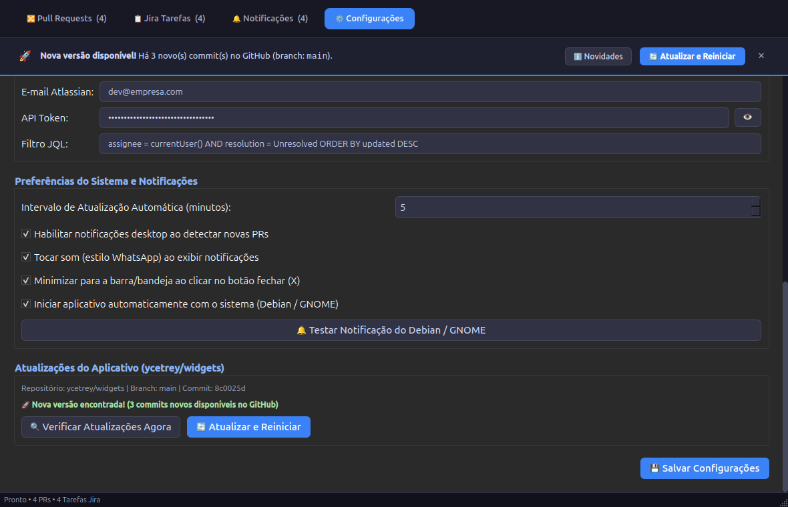

# Dev Status Widget para Linux Debian (GNOME) 🐧

Um aplicativo/widget desktop leve e moderno para Linux Debian (GNOME) com navegação em abas/botões para monitoramento de situações de desenvolvimento, iniciando pelo rastreamento de **Pull Requests (PRs) abertas em múltiplos repositórios do GitHub, organizadas por data da mais antiga para a mais recente**, com suporte a **notificações desktop nativas** e **ícone na bandeja do sistema (system tray)**.

---

## 📸 Demonstração Visual

### 🔀 1. Pull Requests & Alerta de Atualização
Visualização unificada de PRs com badges de urgência por tempo em aberto, status de revisão, checks do CI e o banner interativo de atualização disponível:



### 📋 2. Jira Tarefas (Visão Kanban)
Acompanhamento em tempo real das tarefas atribuídas no Jira, organizadas em colunas por status, prioridades e subtarefas:



### 🔔 3. Histórico de Notificações
Central com histórico de alertas de PRs, Jira e avisos de versão, com botão direto para atualizar e reiniciar o programa:



### ⚙️ 4. Configurações — Repositórios & Autenticação
Gerenciamento de repositórios monitorados e token de acesso pessoal com exibição mascarada e segura:



### 🚀 5. Configurações — Preferências & Atualizações
Controle de notificações, sons, inicialização com o sistema (autostart) e verificação de atualizações do repositório (`ycetrey/widgets`):



---

## ✨ Funcionalidades

- **Navegação por Abas/Botões**:
  - **🔀 Pull Requests**: Visualização centralizada das PRs de todos os repositórios configurados do GitHub, ordenadas da mais antiga para a mais recente.
  - **📋 Jira Tarefas**: Visualização das suas tarefas atribuídas no Jira, com status, prioridades, tempo de atualização e link direto para a issue.
  - **🔔 Notificações**: Coluna com histórico de todas as notificações exibidas (ordenadas da mais nova para a mais antiga), com opção de remover item a item [✕] ou botão "Limpar tudo", com persistência garantida no SQLite para não reexibir itens descartados.
  - **⚙️ Configurações**: Interface gráfica completa para gerenciar repositórios, token do GitHub, credenciais do Jira, intervalo de atualização e notificações sem precisar editar arquivos manuais.
- **🚀 Detecção Automática de Atualizações & Auto-Update (`git pull`)**:
  - Detecção inteligente em segundo plano de novos commits no GitHub (`ycetrey/widgets`).
  - Banner interativo no topo da janela exibindo o resumo de novidades e o botão `[ 🔄 Atualizar e Reiniciar ]`.
  - Notificação nativa interativa no GNOME Desktop (`notify-send -A`).
  - Ação dinâmica no menu do ícone da bandeja do sistema (System Tray).
  - Execução segura de `git pull` com checagem prévia de arquivos modificados localmente e reinicialização desacoplada do aplicativo.
- **Ordenação por Data (Mais antiga para a mais recente)**:
  - Exibe no topo as PRs que estão aguardando revisão há mais tempo (`created_at ASC`).
  - Badges coloridos de urgência baseados no tempo em aberto:
    - 🔴 **Crítico** (14+ dias em aberto)
    - 🟡 **Atenção/Aviso** (4+ dias em aberto)
    - 🔵 **Pendente** (1+ dia em aberto)
    - 🟢 **Recente** (< 24 horas)
  - Botão de alternância rápida caso queira inverter a ordenação.
- **Notificações Desktop Nativas (GNOME)**:
  - Monitoramento em segundo plano.
  - Ao detectar novas PRs ou atualizações, emite uma notificação nativa no GNOME (`notify-send` / FreeDesktop Notification).
- **Ícone na Bandeja do Sistema (System Tray / Top Bar)**:
  - Contador de PRs no tooltip.
  - Clique com botão esquerdo para mostrar/ocultar a janela rapidamente.
  - Menu de contexto com botão direito: *Atualizar Agora*, *Configurações*, *Sair*.
  - Ao clicar no "X" (fechar) da janela, o widget minimiza para a bandeja e continua rodando em segundo plano.
- **Inicialização Automática com o Sistema (Autostart)**:
  - Inicia silenciosamente em segundo plano (minimizado na bandeja) ao fazer login no Debian/GNOME.
  - Pode ser ativado ou desativado com um clique na aba de Configurações ou configurado via XDG Autostart padrão (`~/.config/autostart/dev-status-widget.desktop`).
- **Filtros e Busca Rápida**:
  - Filtro por repositório específico ou visão unificada de todos.
  - Campo de busca instantânea por título, autor (`@usuario`) ou número (`#123`).
  - Botão direto para abrir a PR no navegador padrão do Linux com um clique.

---

## 🚀 Instalação no Linux Debian

### Opção 1: Instalação Automática via Script

Abra o terminal no diretório do projeto e execute:

```bash
chmod +x install.sh
./install.sh
```

O script cuidará de:
1. Instalar os pacotes necessários via `apt` (`python3-pyqt6`, `python3-requests`, `python3-yaml`, `libnotify-bin`, `gnome-shell-extension-appindicator`).
2. Criar o atalho no menu de aplicativos do GNOME (`~/.local/share/applications/dev-status-widget.desktop`).
3. Configurar a inicialização automática com o sistema no login (`~/.config/autostart/dev-status-widget.desktop`).

### Opção 2: Instalação Manual

1. Instale os pacotes do sistema:
   ```bash
   sudo apt update
   sudo apt install -y python3 python3-pip python3-pyqt6 python3-requests python3-yaml libnotify-bin gnome-shell-extension-appindicator
   ```

2. Execute o aplicativo:
   ```bash
   python3 main.py
   ```

   *Dica:* Você pode rodar com dados simulados para testar o visual e as notificações imediatamente:
   ```bash
   python3 main.py --demo
   ```

---

## ⚙️ Configuração

Você pode configurar o aplicativo de duas formas:

### 1. Pela Interface Gráfica (Recomendado)
Clique na aba **⚙️ Configurações** no próprio aplicativo para:
- Adicionar ou remover repositórios (ex: `facebook/react`, `torvalds/linux`, `sua-empresa/projeto`).
- Inserir seu **GitHub Personal Access Token** (opcional para repos públicos, essencial para repositórios privados e para aumentar o limite da API de 60 para 5.000 requisições/hora).
- Configurar credenciais do Jira Cloud (URL, e-mail e API token).
- Marcar a opção **"Iniciar aplicativo automaticamente com o sistema (Debian / GNOME)"**.
- Ajustar o tempo de checagem automática (ex: a cada 5 minutos).
- Clicar em **"🔔 Testar Notificação do Debian / GNOME"** para conferir as notificações na sua tela.

### 2. Pelo arquivo `config.yaml`
O aplicativo lê o arquivo `config.yaml` na raiz do projeto ou em `~/.config/dev-status-widget/config.yaml`:

```yaml
# config.yaml
github_token: "ghp_seu_token_aqui"  # Opcional para repos públicos

repositories:
  - "facebook/react"
  - "golang/go"
  - "torvalds/linux"

refresh_interval_minutes: 5
sort_order: "oldest_first"  # "oldest_first" ou "newest_first"
notifications_enabled: true
minimize_to_tray_on_close: true
autostart: true
```

---

## 💡 Dica para a Barra Superior do GNOME Shell

Por padrão, algumas versões do GNOME Shell ocultam ícones de bandeja legados. Para que o ícone do widget apareça na barra superior:
1. O script `install.sh` instala o pacote `gnome-shell-extension-appindicator`.
2. Abra o aplicativo **Extensões** (ou execute `gnome-extensions-app`).
3. Ative a extensão chamada **"AppIndicator and KStatusNotifierItem Support"**.

*(Mesmo sem a extensão, a janela principal e as notificações do sistema funcionam normalmente).*
